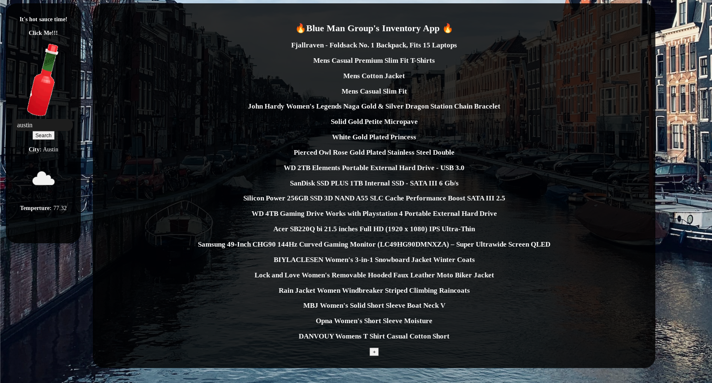
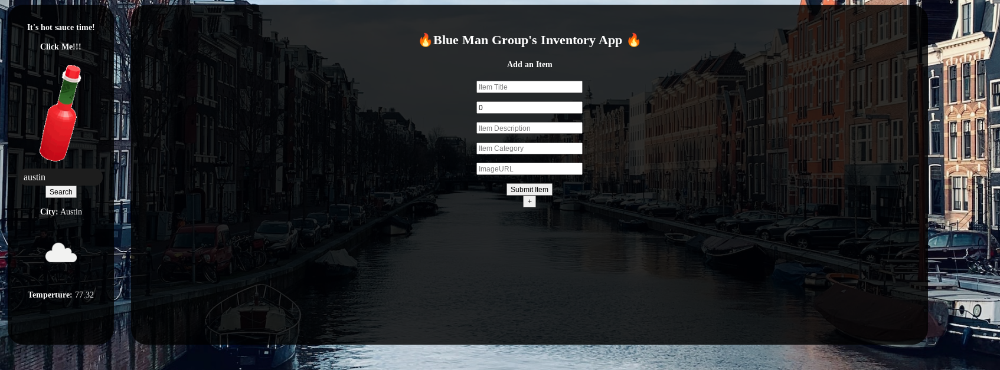
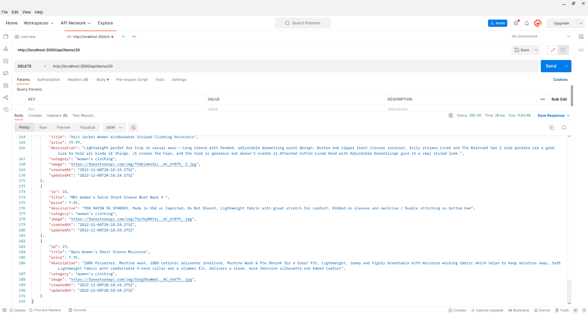
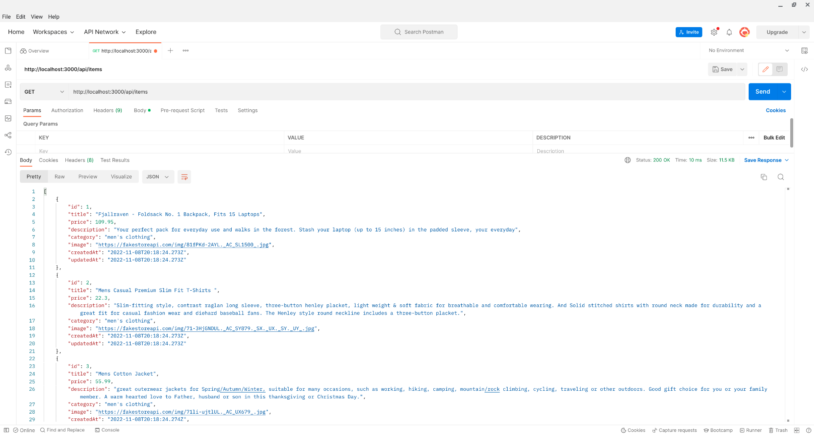
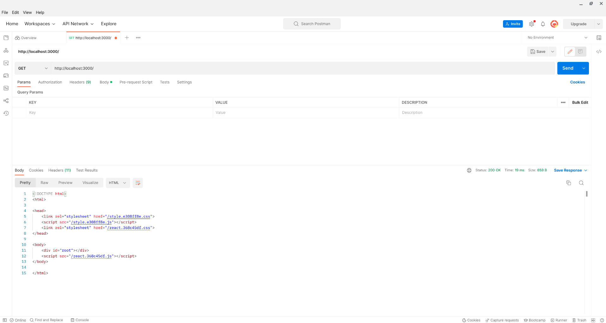
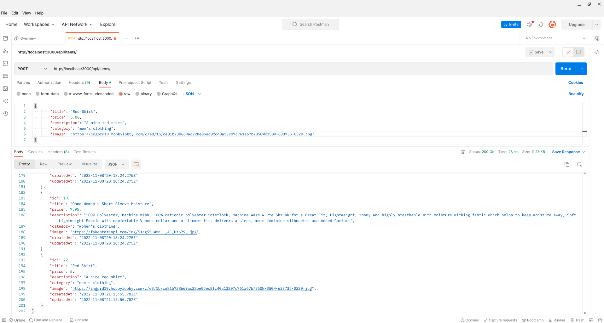
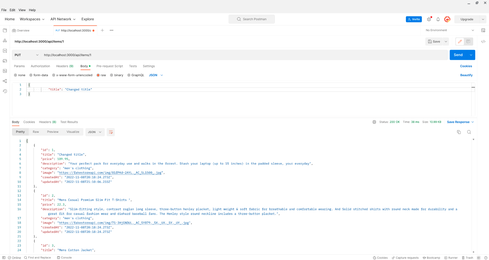

Blue Man Group (aka Jared, Mario, Francis)'s Inventory App!
This is a full-stack application that tracks items, with the feature to add and update items!

https://bluemangroup.up.railway.app/

## Getting Started

1. `npm install`
2. `npm run seed`
3. `npm run server-dev`
4. In a seperate terminal, `npm run client-dev`

# App Outlook

# Postman testing
Testing delete route, item with id 20 was successfully removed from the list

Testing GET route for all items, and was successful in retrieving the full list of items

Testing the GET route to our localhost, was also successful

Testing POST route, successfully able to add an item, in this case it was a red shirt and it populated as the item with id 22.

Testing PUT route, successfully able to update an item on the list, in this case item with id 1 had the title change to test the update.

